# ext-library

> Spring Boot 扩展库 - 提供企业级开发所需的通用功能模块

## 项目概述

ext-library 是一个基于 Spring Boot 的扩展库，采用 Maven 多模块分层聚合结构，为企业级应用开发提供安全、缓存、Web、加密等通用功能支持。

## 技术栈

| 技术                | 版本                      |
|-------------------|-------------------------|
| Java              | 25                      |
| Spring Boot       | 4.0.1                   |
| Maven             | 4.1.0 (POM Model 4.1.0) |
| MapStruct Plus    | 1.5.0                   |
| Bouncy Castle     | 1.83                    |
| SpringDoc OpenAPI | 3.0.0                   |

## 模块结构图

```mermaid
graph TD
    A["ext-library<br/>(根项目)"] --> BOM["ext-bom<br/>BOM 依赖管理"]
    A --> B["ext-common<br/>通用基础层"]
    A --> C["ext-infra<br/>基础设施层"]
    A --> D["ext-security<br/>安全层"]
    A --> E["ext-crypto<br/>加密层"]
    A --> F["ext-web<br/>Web 层"]
    A --> G["ext-enhance<br/>业务增强层"]
    A --> H["ext-misc<br/>杂项工具层"]
    B --> B2["ext-tool<br/>工具类"]
    B --> B3["ext-core<br/>核心功能"]
    B --> B4["ext-json<br/>JSON 处理"]
    C --> C1["ext-redis<br/>Redis 支持"]
    C --> C2["ext-cache<br/>缓存支持"]
    C --> C3["ext-mail<br/>邮件支持"]
    F --> F1["ext-mvc<br/>MVC 支持"]
    F --> F2["ext-openapi<br/>OpenAPI"]
    F --> F3["ext-sse<br/>Server-Sent Events"]
    F --> F4["ext-websocket<br/>WebSocket"]
    G --> G1["ext-captcha<br/>验证码"]
    G --> G2["ext-idempotent<br/>幂等性"]
    G --> G3["ext-desensitize<br/>脱敏"]
    G --> G4["ext-trans<br/>翻译转换"]
    G --> G5["ext-api-crypto<br/>API 加密"]
    H --> H1["ext-http<br/>HTTP 客户端"]
    H --> H2["ext-qrcode<br/>二维码"]
    H --> H3["ext-monitor<br/>系统监控"]
    click B "./ext-common/AGENTS.md" "查看 ext-common 模块文档"
    click C "./ext-infra/AGENTS.md" "查看 ext-infra 模块文档"
    click D "./ext-security/AGENTS.md" "查看 ext-security 模块文档"
    click E "./ext-crypto/AGENTS.md" "查看 ext-crypto 模块文档"
    click F "./ext-web/AGENTS.md" "查看 ext-web 模块文档"
    click G "./ext-enhance/AGENTS.md" "查看 ext-enhance 模块文档"
    click H "./ext-misc/AGENTS.md" "查看 ext-misc 模块文档"
```



## 模块索引

| 模块                                       | 类型   | 描述                                 |
|------------------------------------------|------|------------------------------------|
| ext-bom                                  | 独立模块 | BOM 依赖管理，统一管理所有 ext 模块版本           |
| [ext-common](./ext-common/AGENTS.md)     | 聚合器  | 通用基础层，包含工具类、核心功能、JSON 处理           |
| [ext-infra](./ext-infra/AGENTS.md)       | 聚合器  | 基础设施层，包含 Redis、缓存、邮件支持             |
| [ext-security](./ext-security/AGENTS.md) | 独立模块 | 安全认证与授权框架                          |
| [ext-crypto](./ext-crypto/AGENTS.md)     | 独立模块 | 加密算法工具库 (AES/DES/RSA/SM2/SM4)      |
| [ext-web](./ext-web/AGENTS.md)           | 聚合器  | Web 层，包含 MVC、OpenAPI、SSE、WebSocket |
| [ext-enhance](./ext-enhance/AGENTS.md)   | 聚合器  | 业务增强层，包含验证码、幂等性、脱敏、翻译、API加密        |
| [ext-misc](./ext-misc/AGENTS.md)         | 聚合器  | 杂项工具层，包含 HTTP 客户端、二维码、系统监控         |

## 分层架构

```
+--------------------------------------------------+
|                    ext-bom                        |  BOM 依赖管理
+--------------------------------------------------+
|                  ext-enhance                      |  业务增强层
|  (captcha, idempotent, desensitize, trans, ...)  |
+--------------------------------------------------+
|                    ext-web                        |  Web 层
|      (mvc, openapi, sse, websocket)              |
+--------------------------------------------------+
|     ext-security     |      ext-crypto            |  安全/加密层
+--------------------------------------------------+
|                   ext-infra                       |  基础设施层
|          (redis, cache, mail)                     |
+--------------------------------------------------+
|                  ext-common                       |  通用基础层
|           (tool, core, json)                     |
+--------------------------------------------------+
```

**依赖流向**: 上层模块可依赖下层模块，同层模块可相互依赖，下层模块不得依赖上层模块。

## 构建与测试

```bash
# 先设置使用 JDK-25
export JAVA_HOME=/usr/lib/jvm/java-25-openjdk-amd64

# 完整构建
./mvnw clean install

# 跳过测试构建
./mvnw clean install -DskipTests

# 运行测试
./mvnw test

# 构建单个模块
./mvnw clean install -pl ext-common/ext-tool -am

# 生成源码包
./mvnw source:jar
```

## 关键约定

### 包命名规范

- 基础包名: `ext.library`
- 模块包名: `ext.library.{module}`
- 示例: `ext.library.crypto`, `ext.library.security`, `ext.library.web`

### 自动配置

- 各模块通过 `*AutoConfig` 类提供 Spring Boot 自动配置
- 配置属性前缀: `ext.{module}`

### 版本管理

- 使用 `${revision}` 占位符统一管理版本号
- 当前版本: 4.0.0
- BOM 模块 (ext-bom) 提供所有子模块的版本管理

### 代码风格

- 使用 Java 25 特性
- 遵循 Spring Boot 编码规范
- 使用 MapStruct Plus 进行对象映射
- 使用 Lombok 简化代码 (通过 Spring Boot starter 引入)

## AI 使用指引

1. **修改模块代码前**: 先阅读对应模块的 AGENTS.md 了解模块职责和依赖关系
2. **添加新功能**: 根据功能类型选择合适的层级模块
3. **添加新模块**: 在对应聚合器下创建，并更新 pom.xml 的 subprojects
4. **版本更新**: 仅修改根 pom.xml 中的 `revision` 属性

## 变更记录

| 日期         | 变更内容             |
|------------|------------------|
| 2026-01-19 | 初始化 AGENTS.md 文档 |
