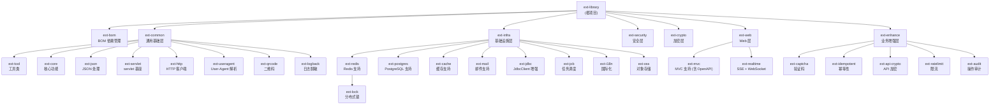

# ext-library

> Spring Boot 扩展库 - 提供企业级开发所需的通用功能模块

## 项目概述

ext-library 是一个基于 Spring Boot 的扩展库，采用 Gradle 多模块分层结构，为企业级应用开发提供安全、缓存、Web、加密等通用功能支持。

## 目标与定位

为同一技术栈（JDK 25 / Spring Boot 4）上的自有后端项目提供一套**可单模块取用**的通用技术能力——安全会话、加解密、缓存、限流、幂等、审计、实时通道、对象存储等——把这些样板代码从业务工程中移出，一次实现、多个项目复用。

**要解决的问题**：每个新服务都要重写同一批横切能力，且各服务口径不一（脱敏规则、token 会话、限流算法、缓存后端各不相同）。没有统一实现就只能复制粘贴，改进无法回传。

**受众**：作者及其团队在同一技术栈上的自有项目。库以 Apache 2.0 开源形式公开，公开是副产品，不代表对外承诺 API 稳定性。

## 非目标

- **不重复造 Spring Boot / Spring Security 已提供的能力**：能复用其实现就复用（AES 与密码编码走 Spring Security Crypto），本库只做扩展与收敛。
- **不含业务领域模型**：只做技术基础能力；权限与角色数据由业务方实现 `SecurityAuthority` 提供，库不定义用户、订单等领域对象。
- **不支持旧版本运行时**：只跟进 JDK 25 与 Spring Boot 4，不为 JDK 17/21 或 Spring Boot 3 保留兼容分支。
- **不提供全量引入的聚合 starter**：每个模块必须能单独依赖；重后端（Redis / PostgreSQL）一律 `compileOnly` + 类路径探测，不把中间件强加给消费方。

## 设计原则

- 横切能力以**注解 + 切面**接入业务，业务代码不写调用样板。
- 同一口径只实现一次：脱敏策略由 `ext-json` 定义，日志脱敏与接口返回复用同一套策略。
- 可选实现统一用 **SPI + 自动探测**（存储、策略、处理器），配置只选行为，不选类。

## 技术栈

| 技术              | 版本               |
|-------------------|--------------------|
| Java              | 25                 |
| Spring Boot       | 4.1.1              |
| Gradle            | 9.8.1 (Groovy DSL) |
| Bouncy Castle     | 1.86               |
| SpringDoc OpenAPI | 3.1.1              |

## 模块结构图


```mermaid
graph TD
    A["ext-library<br/>(根项目)"] --> BOM["ext-bom<br/>BOM 依赖管理"]
    A --> B["ext-common<br/>通用基础层"]
    A --> C["ext-infra<br/>基础设施层"]
    A --> D["ext-security<br/>安全层"]
    A --> E["ext-crypto<br/>加密层"]
    A --> F["ext-web<br/>Web 层"]
    A --> G["ext-enhance<br/>业务增强层"]
    B --> B2["ext-tool<br/>工具类"]
    B --> B3["ext-core<br/>核心功能"]
    B --> B4["ext-json<br/>JSON 处理"]
    B --> B5["ext-servlet<br/>servlet 基座"]
    B --> B6["ext-http<br/>HTTP 客户端"]
    B --> B7["ext-useragent<br/>User-Agent 解析"]
    B --> B8["ext-qrcode<br/>二维码"]
    B --> B9["ext-logback<br/>日志脱敏"]
    C --> C1["ext-redis<br/>Redis 支持"]
    C --> C1b["ext-postgres<br/>PostgreSQL 支持"]
    C --> C2["ext-cache<br/>缓存支持"]
    C --> C3["ext-mail<br/>邮件支持"]
    C --> C1d["ext-jdbc<br/>JdbcClient 增强"]
    C --> C1e["ext-job<br/>任务调度"]
    C1 --> C1c["ext-lock<br/>分布式锁"]
    C --> C1f["ext-i18n<br/>国际化"]
    C --> C1g["ext-oss<br/>对象存储"]
    F --> F1["ext-mvc<br/>MVC 支持 (含 OpenAPI)"]
    F --> F2["ext-realtime<br/>SSE + WebSocket"]
    G --> G1["ext-captcha<br/>验证码"]
    G --> G2["ext-idempotent<br/>幂等性"]
    G --> G3["ext-api-crypto<br/>API 加密"]
    G --> G4["ext-ratelimit<br/>限流"]
    G --> G5["ext-audit<br/>操作审计"]
    click B "./ext-common/AGENTS.md" "查看 ext-common 模块文档"
    click C "./ext-infra/AGENTS.md" "查看 ext-infra 模块文档"
    click D "./ext-security/AGENTS.md" "查看 ext-security 模块文档"
    click E "./ext-crypto/AGENTS.md" "查看 ext-crypto 模块文档"
    click F "./ext-web/AGENTS.md" "查看 ext-web 模块文档"
    click G "./ext-enhance/AGENTS.md" "查看 ext-enhance 模块文档"
```

## 模块索引

| 模块                                     | 类型     | 描述                                           |
|------------------------------------------|----------|------------------------------------------------|
| ext-bom                                  | 独立模块 | BOM 依赖管理，统一管理所有 ext 模块版本        |
| [ext-common](./ext-common/AGENTS.md)     | 分层     | 通用基础层，包含工具类��核心功能、JSON 处理、servlet 基座、HTTP 客户端、UA 解析、二维码、日志脱敏 |
| [ext-infra](./ext-infra/AGENTS.md)       | 分层     | 基础设施层，包含 Redis、PostgreSQL、缓存、邮件、锁、JDBC、任务调度、国际化、对象存储 |
| [ext-security](./ext-security/AGENTS.md) | 独立模块 | 安全认证与授权框架（会话、权限、两步验证、通行密钥） |
| [ext-crypto](./ext-crypto/AGENTS.md)     | 独立模块 | 加密算法工具库 (AES/RSA/SM2/SM3/SM4)           |
| [ext-web](./ext-web/AGENTS.md)           | 分层     | Web 层，包含 MVC 与实时通信                    |
| [ext-enhance](./ext-enhance/AGENTS.md)   | 分层     | 业务增强层，包含验证码、幂等性、API加密、限流、审计  |

## ext-bom

**职责**：唯一的版本约束来源（`java-platform`）。导入 `spring-boot-dependencies` 覆盖 Spring 全家桶，导入 `software.amazon.awssdk:bom` 覆盖 [ext-oss](ext-infra/AGENTS.md#ext-oss) 的 S3 客户端，逐个约束不在任何 BOM 的第三方（bouncycastle、zxing、swagger-annotations、springdoc、webauthn4j、twelvemonkeys），并把 26 个 ext 模块的版本一并约束。消费方只需 `platform('ext.library:ext-bom:<version>')`，再按需引模块、不写版本号。

**优先复用官方 BOM**：第三方自己带 BOM（如 `software.amazon.awssdk:bom`）就 `platform(...)` 导入，不要把它的几十个 artifact 拆成 constraint——逐个约束跟不上官方拆包节奏，还会诱使模块混引不同版本的 service client。

**边界**：不含任何代码，不套 `java-library`；不是聚合 starter——导 BOM 不等于引入模块（见 [非目标](#非目标)）。

**不变量**：

- 第三方版本值只出现在 `gradle.properties`，约束只出现在这里。新增第三方依赖必须先加 `gradle.properties` 键，再加 constraint，否则版本无处收敛。
- 新增模块必须同时登记在 `settings.gradle` 与这里的 constraints，否则不进依赖管理。
- 所有叶子通过根 `build.gradle` 的 `api platform(project(':ext-bom'))` 继承约束；模块 `build.gradle` 不得自写版本号。

**分发**：构建侧只配置了 `publishToMavenLocal`。

## 分层架构

```
+------------------------------------------------------------+
|                       ext-bom                             |  BOM 依赖管理
+------------------------------------------------------------+
|                       ext-enhance                         |  业务增强层
|          (captcha, idempotent, api-crypto, ratelimit, audit)|
+------------------------------------------------------------+
|                       ext-web                             |  Web 层
|                    (mvc, realtime)                        |
+------------------------------------------------------------+
|     ext-security                 ext-crypto               |  安全/加密层
+------------------------------------------------------------+
|                       ext-infra                            |  基础设施层
|      (redis, postgres, cache, mail, lock, jdbc, job, i18n, oss) |
+------------------------------------------------------------+
|                       ext-common                           |  通用基础层
|     (tool, core, json, servlet, http, useragent, qrcode, logback) |
+------------------------------------------------------------+
```

**依赖流向**: 上层模块可依赖下层模块，同层模块可相互依赖，下层模块不得依赖上层模块。

## 构建与测试

```bash
# 完整构建（编译 + 测试 + 安装到本地仓库）
./gradlew clean build

# 跳过测试
./gradlew clean build -x test

# 运行测试
./gradlew test

# 构建单个模块（含依赖）
./gradlew :ext-common:ext-tool:build

# 只发布到本地仓库
./gradlew publishToMavenLocal

# 生成源码包
./gradlew sourcesJar
```

## 关键约定

### 包命名规范

- 基础包名: `ext.library`
- 模块包名: `ext.library.{module}`
- 示例: `ext.library.crypto`, `ext.library.security`, `ext.library.web`

### 自动配置

- 各模块通过 `*AutoConfig` 类提供 Spring Boot 自动配置
- 配置属性前缀: `ext.{module}`

### 版本管理

所有依赖版本集中在 `gradle.properties`：

- `version` — 项目自身版本，所有 ext 模块共用
- `springBootVersion` — Spring Boot 全家桶版本，通过 `spring-boot-dependencies` BOM 管理所有 `org.springframework.*` 等依赖
- `bouncyCastleVersion` / `zxingVersion` / `swaggerAnnotationsVersion` / `springdocVersion` / `awsSdkVersion` /
  `webauthn4jVersion` / `jetbrainsAnnotationsVersion` / `s3mockVersion`（仅测试）— 不在其他 BOM 里单独约束的第三方依赖

约束声明在 `ext-bom/build.gradle`，与 ext 模块版本一起发布给消费方。

### 代码风格

- 使用 Java 25 特性
- 遵循 Spring Boot 编码规范
- 对象映射使用 Spring `BeanUtils`（见 `ext-common/ext-core` 的 `BeanUtil`）
- 使用 Lombok 简化代码 (通过 Spring Boot starter 引入)

## AI 使用指引

1. **修改模块代码前**: 先阅读对应模块的 AGENTS.md 了解模块职责和依赖关系
2. **添加新功能**: 根据功能类型选择合适的层级模块
3. **添加新模块**: 在对应层目录下创建，并更新 settings.gradle 的 include 列表
4. **版本更新**: 修改 gradle.properties 的 `version` 属性

## 变更记录

| 日期       | 变更内容                                                              |
|------------|-----------------------------------------------------------------------|
| 2026-01-19 | 初始化 AGENTS.md 文档                                                 |
| 2026-10-10 | 构建方式从 Maven 切换为 Gradle (Groovy DSL)                           |
| 2026-10-10 | 依赖版本统一收敛到 gradle.properties，第三方依赖移入 ext-bom          |
| 2026-10-10 | AI 编程工具从 Claude Code 切换为 pi-agent，CLAUDE.md 更名为 AGENTS.md |
| 2026-10-10 | 新增 ext-jdbc、ext-job、ext-i18n、ext-oss |
| 2026-10-10 | 新增 ext-postgres、ext-lock、ext-ratelimit、ext-audit、ext-logback |
| 2026-10-11 | 解散 ext-misc 层：ext-http / ext-qrcode / ext-useragent / ext-logback 归入 ext-common，ext-i18n / ext-oss 归入 ext-infra |
| 2026-10-31 | 27 个 SPEC.md 正文并入各层 AGENTS.md 的「设计约束」节，SPEC 文档删除（AI 读 AGENTS.md 即可，不再两处维护） |
| 2026-10-31 | `goal-and-requirements.md` 的目标 / 非目标 / 设计原则并入根 AGENTS.md，原文档删除 |
| 2026-11-01 | ext-oss 移除 SFTP 后端（presign 无法实现，属接口违约），只留 local + S3；sshd 依赖与 BOM 约束删除 |
| 2026-11-01 | ext-security 新增两步验证（TOTP）与通行密钥（WebAuthn，webauthn4j-core）；ext-bom 新增 webauthn4j 与 org.jetbrains:annotations 约束 |
