# CLAUDE.md

本文件为 Claude Code (claude.ai/code) 在处理此代码库时提供指导。

## 项目愿景

**ext-library** 是一个全面的 Spring Boot 扩展库（当前版本 4.0.0），基于 **Spring Boot 4.0.0** 和 **JDK 25** 构建。它提供模块化组件来解决常见的开发挑战，遵循自动配置和注解驱动的设计模式。

### 技术栈
- **Java**: 25
- **Spring Boot**: 4.0.0
- **Spring AI**: 1.1.0
- **构建工具**: Maven（多模块）
- **主要依赖**: Google Guava、MapStruct Plus、MyBatis-Flex、SpringDoc 3.0.0

## 模块结构图

```mermaid
graph TD
    A["(根) ext-library"] --> B["核心模块"];
    A --> C["功能模块"];
    A --> D["增强模块"];

    B --> B1["ext-tool<br/>基础工具类"];
    B --> B2["ext-core<br/>Spring 基础"];
    B --> B3["ext-redis<br/>Redis 集成"];
    B --> B4["ext-json<br/>JSON 处理"];

    C --> C1["ext-cache<br/>缓存解决方案"];
    C --> C2["ext-crypto<br/>加密操作"];
    C --> C3["ext-captcha<br/>验证码生成"];
    C --> C4["ext-http<br/>HTTP 客户端"];
    C --> C5["ext-idempotent<br/>幂等性支持"];
    C --> C6["ext-interface-crypto<br/>接口加密"];
    C --> C7["ext-qrcode<br/>二维码生成"];
    C --> C8["ext-trans<br/>分布式事务"];

    D --> D1["ext-web<br/>Web 层工具"];
    D --> D2["ext-websocket<br/>WebSocket 支持"];
    D --> D3["ext-sse<br/>Server-Sent Events"];
    D --> D4["ext-security<br/>安全组件"];
    D --> D5["ext-ratelimiter<br/>限流"];
    D --> D6["ext-openapi<br/>API 文档"];
    D --> D7["ext-mail<br/>邮件发送"];
    D --> D8["ext-monitor<br/>系统监控"];
    D --> D9["ext-mybatis<br/>MyBatis 集成"];
    D --> D10["ext-desensitize<br/>数据脱敏"];
    D --> D11["ext-ai<br/>AI 集成(开发中)"];

    click B1 "./ext-tool/CLAUDE.md" "查看 ext-tool 模块文档"
    click B2 "./ext-core/CLAUDE.md" "查看 ext-core 模块文档"
    click B3 "./ext-redis/CLAUDE.md" "查看 ext-redis 模块文档"
    click B4 "./ext-json/CLAUDE.md" "查看 ext-json 模块文档"
    click C1 "./ext-cache/CLAUDE.md" "查看 ext-cache 模块文档"
    click C2 "./ext-crypto/CLAUDE.md" "查看 ext-crypto 模块文档"
    click C3 "./ext-captcha/CLAUDE.md" "查看 ext-captcha 模块文档"
    click C4 "./ext-http/CLAUDE.md" "查看 ext-http 模块文档"
    click C5 "./ext-idempotent/CLAUDE.md" "查看 ext-idempotent 模块文档"
    click C6 "./ext-interface-crypto/CLAUDE.md" "查看 ext-interface-crypto 模块文档"
    click C7 "./ext-qrcode/CLAUDE.md" "查看 ext-qrcode 模块文档"
    click C8 "./ext-trans/CLAUDE.md" "查看 ext-trans 模块文档"
    click D1 "./ext-web/CLAUDE.md" "查看 ext-web 模块文档"
    click D2 "./ext-websocket/CLAUDE.md" "查看 ext-websocket 模块文档"
    click D3 "./ext-sse/CLAUDE.md" "查看 ext-sse 模块文档"
    click D4 "./ext-security/CLAUDE.md" "查看 ext-security 模块文档"
    click D5 "./ext-ratelimiter/CLAUDE.md" "查看 ext-ratelimiter 模块文档"
    click D6 "./ext-openapi/CLAUDE.md" "查看 ext-openapi 模块文档"
    click D7 "./ext-mail/CLAUDE.md" "查看 ext-mail 模块文档"
    click D8 "./ext-monitor/CLAUDE.md" "查看 ext-monitor 模块文档"
    click D9 "./ext-mybatis/CLAUDE.md" "查看 ext-mybatis 模块文档"
    click D10 "./ext-desensitize/CLAUDE.md" "查看 ext-desensitize 模块文档"
```



## 模块索引

| 模块 | 类型 | 职责 | 状态 | 测试 |
|------|------|------|------|------|
| ext-tool | 基础 | 通用工具类，基于 Guava | ✅ 稳定 | ✅ 6个测试 |
| ext-core | 核心 | Spring 基础集成 | ✅ 稳定 | ❌ 待补充 |
| ext-redis | 核心 | Redis 集成和工具 | ✅ 稳定 | ❌ 待补充 |
| ext-json | 核心 | JSON 处理增强 | ✅ 稳定 | ❌ 待补充 |
| ext-cache | 功能 | 注解驱动缓存解决方案 | ✅ 稳定 | ❌ 待补充 |
| ext-crypto | 功能 | 加密算法工具类 | ✅ 稳定 | ✅ 6个测试 |
| ext-captcha | 功能 | 验证码生成服务 | ✅ 稳定 | ❌ 待补充 |
| ext-http | 功能 | HTTP 客户端增强 | ✅ 稳定 | ❌ 待补充 |
| ext-idempotent | 功能 | 请求幂等性支持 | ✅ 稳定 | ❌ 待补充 |
| ext-interface-crypto | 功能 | 接口请求/响应加密 | ✅ 稳定 | ❌ 待补充 |
| ext-web | 增强 | Web 层工具和增强 | ✅ 稳定 | ❌ 待补充 |
| ext-websocket | 增强 | WebSocket 支持 | ✅ 稳定 | ❌ 待补充 |
| ext-sse | 增强 | Server-Sent Events | ✅ 稳定 | ❌ 待补充 |
| ext-security | 增强 | 安全认证和授权 | ✅ 稳定 | ❌ 待补充 |
| ext-ratelimiter | 增强 | API 限流实现 | ✅ 稳定 | ❌ 待补充 |
| ext-openapi | 增强 | OpenAPI 文档生成 | ✅ 稳定 | ❌ 待补充 |
| ext-mail | 增强 | 邮件发送服务 | ✅ 稳定 | ❌ 待补充 |
| ext-monitor | 增强 | 系统监控指标 | ✅ 稳定 | ❌ 待补充 |
| ext-mybatis | 增强 | MyBatis-Flex 集成 | ✅ 稳定 | ❌ 待补充 |
| ext-desensitize | 增强 | 敏感数据脱敏 | ✅ 稳定 | ❌ 待补充 |
| ext-qrcode | 功能 | 二维码生成 | ✅ 稳定 | ❌ 待补充 |
| ext-trans | 功能 | 数据翻译和转换 | ✅ 稳定 | ❌ 待补充 |
| ext-ai | 开发 | AI 模型集成 | 🚧 开发中 | ❌ 待补充 |

## 架构总览

代码库采用 **Maven 多模块架构**，每个 `ext-*` 模块都可以独立部署，专注于特定领域：

### 核心设计模式

1. **自动配置模式**
   - 使用 `@AutoConfiguration` 注解
   - 通过 `@EnableConfigurationProperties` 绑定配置
   - 基于 `@ConditionalOnProperty` 控制模块启用

2. **AOP 驱动的注解**
   - `@Cache` - 方法级缓存
   - `@Idempotent` - 幂等性强制
   - `@RequestDecrypt/@ResponseEncrypt` - 加密处理
   - `@RateLimit` - API 限流
   - `@Sensitive` - 数据脱敏

3. **策略模式**
   - 缓存策略（Caffeine、Redis、L2）
   - 加密策略（AES、RSA、SM2、SM4、DES）
   - 验证码绘制策略

4. **SpEL 集成**
   - 动态键生成和表达式解析
   - 支持方法参数、返回值、bean 属性访问

### 核心模块详解

#### `ext-tool` - 基础工具类
- **包路径**: `ext.library.tool.*`
- **核心组件**:
  - `core/`: `Threads`, `Systems`, `Runtimes`, `Exceptions`, `VirtualThreadPools`
  - `util/`: `DateUtil`, `CalcUtil`, `String/Collection/Map 工具类`, `IDUtil` (雪花算法ID)
  - `holder/`: `Lazy`（延迟加载）, `Once`, `Unchecked`（异常包装）
  - `domain/`: `SnowflakeId`, `Version`, `MongoObjectId`
  - **依赖**: Google Guava（主要）
- **使用场景**: 作为基础工具始终包含

#### `ext-core` - Spring 基础
- **包路径**: `ext.library.core.*`
- **核心组件**:
  - `config/`: `ThreadPoolConfig` - 自动配置的线程池（异步 & 定时任务）
  - `util/`: `BeanUtil`, `SpelUtil`, `AspectUtil`, `SpringUtil`, `ServletUtil`, `ValidatorUtil`
  - `constant/`: `PatternPool` - 常用正则表达式
- **架构模式**:
  - 使用 `@AutoConfiguration` 配合 `@EnableConfigurationProperties`
  - 基于 Spring 的 `ThreadPoolTaskExecutor` 和 `ScheduledExecutorService`
  - 集成 `MapStruct`（通过 `BeanUtil`）和 CGLIB `BeanCopier` 优化 bean 操作

## 运行与开发

### 构建命令

```bash
# 安装依赖并构建所有模块
mvn clean install

# 构建特定模块
mvn clean install -pl ext-core -am

# 运行测试
mvn test

# 生成源码 JAR
mvn clean package source:jar
```

### 快速使用

```xml
<dependency>
    <groupId>ext.library</groupId>
    <artifactId>ext-core</artifactId>
    <version>4.0.0</version>
</dependency>
```

### 配置示例

```yaml
# 线程池配置
thread-pool:
  enabled: true
  core-pool-size: 8
  max-pool-size: 20

# 缓存配置
ext:
  cache:
    type: L2  # FULL, PARTIAL, PUT, DELETE
```

## 测试策略

- **单元测试**: 使用 JUnit 5，位于 `src/test/java`
- **当前覆盖**: 12 个测试类（主要在 ext-tool 和 ext-crypto）
- **需要补充**: 大部分模块缺少单元测试
- **测试模式**: 控制台输出验证为主

## 编码规范

### 包结构约定
```
ext.<模块名>
  ├── config              // 自动配置类
  ├── config/properties   // 配置属性类
  ├── annotation          // 自定义注解
  ├── aspect              // AOP 切面
  ├── util                // 静态工具类
  ├── core                // 核心业务逻辑
  ├── strategy            // 策略实现
  ├── enums               // 枚举
  └── vo/dto              // 视图对象
```

### 命名约定
- 类名：使用清晰的功能性命名
- 日志：使用 `[🌊]` emoji 前缀标识
- 异常：继承自 `ExtException` 或 `BizException`
- 常量：使用 `Holder` 类存储

## AI 使用指引

### 代码生成建议
1. 遵循现有的包结构约定
2. 使用 `@AutoConfiguration` 进行 Spring 集成
3. 优先使用策略模式实现可扩展性
4. 利用 SpEL 表达式支持动态配置

### 常见任务
- 添加新模块：参考现有模块结构
- 实现缓存策略：实现 `CacheStrategy` 接口
- 添加注解功能：使用 AOP 切面处理
- 集成外部库：通过自动配置类管理 Bean

## 重要注意事项

### JDK 25 兼容性
- 使用最新的 Java 特性
- OSHI 依赖使用 `oshi-core-java25`
- 注意已弃用的 API

### Spring Boot 4.0.0 适配
- 使用 Jakarta EE 命名空间
- 部分 API 可能有变化，正在适配中

### Maven 构建警告
- Guice 库的 `sun.misc.Unsafe` 警告可忽略
- 这是第三方依赖问题，不影响功能

### 模块独立性
每个模块都可以独立使用 - 无需包含所有模块。根据需求选择。

## 变更记录 (Changelog)

### 2025-12-19
- 🆕 新增：完整的模块架构文档
- 🆕 新增：Mermaid 模块结构图
- 🆕 新增：.claude/index.json 索引文件
- 📊 统计：22 个模块，305 个 Java 文件
- 📝 更新：版本信息至 4.0.0